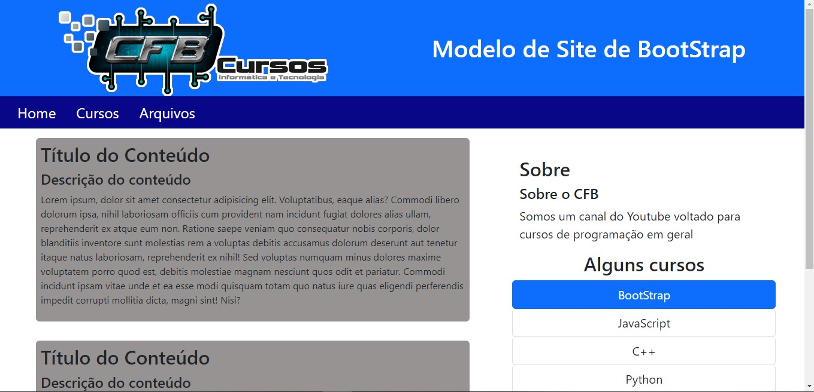
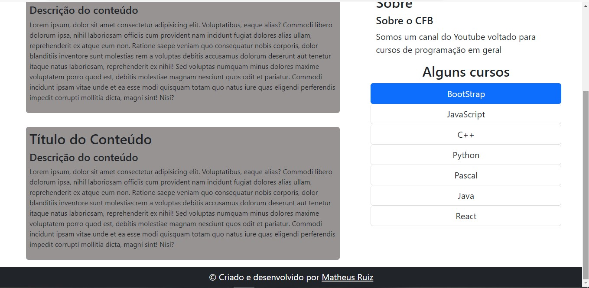

# CFB Cursos

## :memo: Descrição do Projeto

Projeto final do curso do youtuber Bruno do canal CFB Cursos

##  Desenvolvido com: 
 <strong> HTML</strong>
 <strong>CSS</strong>
 <strong>BootStrap</strong>
          